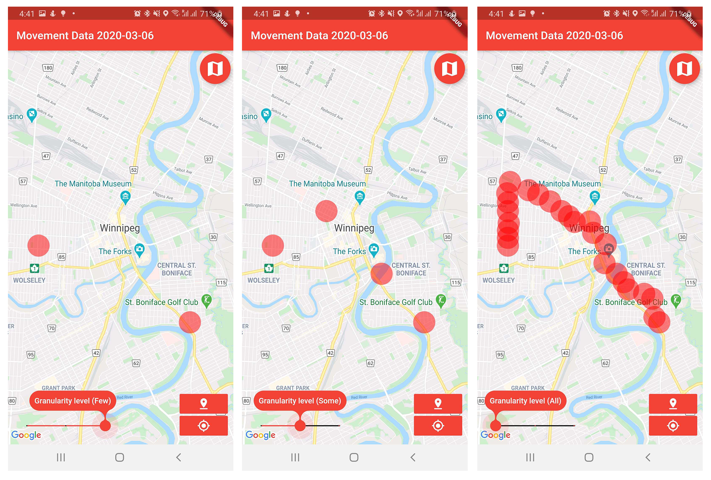

## The list of projects with CGI Inc., Canada (February 2022 to Present) -  Starting with the most recent ones

**1. Building an effecient data pipeline to migarte the no-prem data to cloud and developing a test automation framework to support DevOps and data quality - A renowned Canadian security service in Manitoba, Canada:**  

**As a Data Engineer,** I was responsible to build a data pipeline to transition the on-prem data to cloud environment to support their analytics projects. I had to follow the data engineering best practices to build their cloud environment. I also developed the test automation framework to support the data quality process.

**Tools and Platforms:** Azure Synapse, Azure DevOps, SQL server Management Studio.  

**2. Cloud-based Solution for seamless Data Integration and Analytics - A global retail company in British Columbia, Canada (May 2022 to Present).**  
**As a Data Engineer,** I gathered data requirements identifying the current scopes for a better cloud-based data solution, I was involved to retire their current Enterprise Landing Area (ELA) in Oracle and migrate everything to Snowflake. I also suggested a better pipeline of ETL/Ingestion for data transformation and validation, and finally proposed an overall cloud-based solution using Snowflake to leverage it's power for seamless analysis and reporting.

**Tools and Platforms:** Informatica, Snowflake, Apache Airflow, Jenkins, Power BI.  

**3. Modernization of Primary Care Division (PCD) to leverage the Business Intelligence for effective analytics- Govt. of British Columbia, Canada (02/22 to 05/22)**  
**As a Data Analyst,** I gathered data requirements identifying data elements along with its source, created a flow to clearly show how the data is coming into the system, generated the current and future process flows to show the current state and what can be improved. I also identified gaps requiring resolution for better data streamlining and automated validation, suggested an ETL/Ingestion tool for data transformation and validation, and proposed an overall solution to leverage the Business Intelligence (BI) technology for automatic analysis and reporting.  

## The list of projects with the Government of British Columbia, Canada (June 2020 to February 2022)

**1. British  Columbia  COVID-19  Daily  Cases:** This  BI  report contains a  breakdown of daily COVID-19 cases reported by the BC Centre for Disease Control (BCCDC). It also comprises positive cases, hospitalizations, deaths, laboratory tests, breakthrough analysis of cases by vaccination status, and time-series information for all geography levels. 

**2. Daily Monitoring Dashboard for COVID-19 Sites:** This BI report provides break-downs of  COVID-19  immunizations for the  B.C.  population.   The report allows data exploration by geography, age group, and select priority populations. 

**3. British Columbia COVID-19 Registration, Appointment, and Vaccination Coverage:** This BI report provides breakdowns of registrations, appointments, and COVID-19 vaccinations for the B.C. population. The report allows data exploration by date range, geography, age group, and for various stages along a person’s journey to be fully vaccinated. 

**4. British Columbia Emergency Departments:** This BI report provides an overview of ED visits, including patient demographics and waits times as compared to benchmarks set by the Canadian Association of Emergency Physicians.  The purpose of this report is to provide an overview of where EDs are experiencing congestion and capacity issues over time and across triage levels. 

**5. British Columbia Surgical Wait Times:** This BI report allows users to monitor access to surgeries by reviewing surgical indicators. 

**6. Mental Health and Substance Use Service:** The Mental Health and Substance Use Ser-vice, 2018/19 BI report consists of 11 measures.  These measures are reported by sex, age group, health condition, geographic location, and service type (community data only) on an annual basis starting with the fiscal year 2018/19. 

**7. Analysis and Visualization of Patient-Centred Measurement data:**  In this project, I worked on the Emergency Department (ED) survey to show results from a range of survey questions that provides patients’ perspectives on the quality of patient care in emergency departments in the province of British Columbia. The 2018 and 2021 surveys are profiled here. 

**8. National Health Expenditures:** This BI report visualizes the full National Health Expenditure (NHEX) dataset from the Canadian Institute of Health Information (CIHI), providing a way to quickly search the full data tables and look at health spending trends from 1975-2019. The report is designed to let users quickly compare other jurisdictions’ health spending to British Columbia’s. The NHEX dataset covers public, private, and provincial/territorial government spending across Canada by use of funds and source of finance. 

**9. British Columbia Virtual Care Physician dashboard:** This BI report focuses on the physician provision of virtual care. It summarizes the changes around, and impact of, virtual care before and during (and eventually after) the COVID-19 pandemic. It provides quantifiable information on the provision and impact of virtual care on the health system. This report contains a series of figures and tables summarizing the historical and current state for the use of Virtual Care in B.C. 

**Tools and Languages:** SQL, DAX, Power Query (M), R, Power BI, Visual Studio (to build a tabular model for Analysis Services), Tabular Editor, and SQL Server Management Studio (to deploy and manage access to tabular models in analysis services).

## Academic Projects: During my masters study at the University of Manitoba

**1. Custom Selectable Text Widget for Controlled Text Selection in Mobile device (Jan 2021 – Apr 2021)**  
**Project description:** In this course project, I focused on text selection and layout, where I developed a customized text selection widget that will offer additional functionality in addition to what generally comes with the default text selection widget in most mobile apps. My developed widget will give users more control over text selection and layout than the default one. The solution is initially designed for Text selection and layout on mobile devices. 
**Programming platform:** Android, Dart (Flutter). [source code](https://github.com/walid-shaiket/flutter-engage_selectable-text).

**2. Visualizing Interesting Association Rules from COVID-19 Datasets (Jan 2020 – Apr 2020)**  
**Project description:** This project involves applying data mining techniques on COVID-19 data to extract association rules and visualize these rules as a network. We explore the use of association rule networks, where association rules are represented as nodes with edges connecting to items within the rule as a method to extract interesting patterns within a variety of COVID-19 datasets. [This GitHub repository](https://github.com/walid-shaiket/Adv-data-mining-project) includes code and supplementary materials for the project. 
 
**Programming platform:** Python, Jupyter Notebook.

**3. COVID-19 Disease Tracking (Mar 2020 – Jun 2020)** 
**Project description:** In this project, As a member of the development team, I developed an MVP mobile application for disease tracking during COVID-19 for both Android and iPhone. We explored the possibility to use technology to contain highly infectious diseases through GPS data sharing. And our results show that people are, very often, willing to share their GPS data in an effort to contain highly infectious diseases such as COVID-19, as long as their privacy is protected. Our conclusion indicates the great potential to use novel approaches to tackle highly infectious diseases such as COVID-19. 
  
**Programming platform:** Android, Dart (Flutter). [Project Link](http://hci.cs.umanitoba.ca/projects-and-research/details/covid-19-disease-tracking).

**4. Chronic Kidney disease (CKD) Classification from real-life clinical data (Jan 2020 – May 2020)** 
**Project description:** This is an individual project under the [Visual and Automated Disease Analytics (VADA)](https://vada.cs.umanitoba.ca/) program which is a graduate-level seminar course. This program is a joint initiative between the University of Manitoba and the University of Victoria. As a part of this program, I completed a data science project which includes: I) Data Management Plan, Data dictionary, and Data Quality Report of CKD data set (II) Analysis which includes Cluster analysis, Regression, Classification and Dimension reduction, and (III) Visualization of useful insights using Tableau. 
**Programming platform and Tools:** R, Python, and Tableau.

**5. In-situation 3D Data visualization and Interaction using a smart wearable ring (Jan 2020 – Mar 2020)** 
**Project description:** Wearable technologies, such as watches, rings, and head-worn displays (HWDs) are becoming commonplace nowadays. In this project, we tried to develop a prototype where we are interested to interact and answer some complex queries from a 3D visualization using a smart wearable ring. The main objective was to design some complex and accurate interactions which include analyzing a data set after visualization, perform different actions like selecting, finding patterns, answering some important questions, revealing better insight from a 3D visualization. 
**Programming platform and Tools:** C#, Unity.
